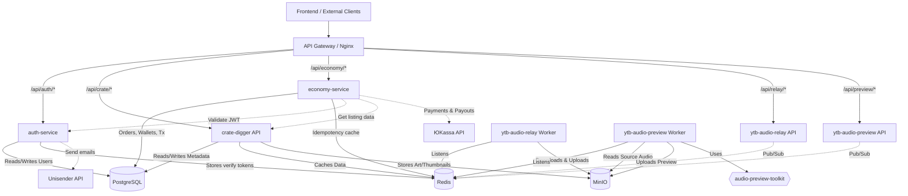
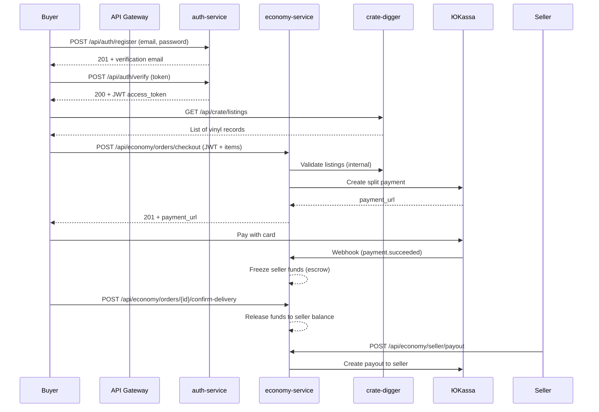

# 🎧 Crate Digger Audio Ecosystem

Welcome to the central orchestration repository for the Crate Digger Audio Ecosystem.

This repository (`api-gateway` / `crate-digger-compose`) acts as the unified entry point for the entire platform. It houses the Nginx API Gateway and the master `docker-compose.yml` that binds together a suite of decoupled, event-driven microservices, shared infrastructure, and background workers.

## 📦 Packages & Artifacts

| Component | Type | Install / Pull Command | Status |
| --- | --- | --- | --- |
| Crate Digger API | Docker | `docker pull ghcr.io/nikiforidi/crate-digger:latest` |  |
| Crate Digger TS | npm | `npm i @nikiforidi/crate-digger-ts` |  |
| Auth Service | Docker | `docker pull ghcr.io/nikiforidi/auth-service:latest` |  |
| Economy Service | Docker | `docker pull ghcr.io/nikiforidi/economy-service:latest` |  |
| YTB Audio Relay | Docker | `docker pull ghcr.io/nikiforidi/ytb-audio-relay:latest` |  |
| YTB Audio Relay TS | npm | `npm i @nikiforidi/ytb-audio-relay-client` |  |
| YTB Audio Preview | Docker | `docker pull ghcr.io/nikiforidi/ytb-audio-preview:latest` |  |
| YTB Audio Preview TS | npm | `npm i @nikiforidi/ytb-audio-preview-client` |  |
| Audio Toolkit | PyPI | `pip install audio-preview-toolkit` |  |

## 🏗️ High-Level Architecture

The ecosystem follows a microservices architecture, utilizing Redis Pub/Sub for asynchronous event broadcasting and MinIO for distributed object storage.



## 🛒 End-to-End Flow: Purchasing a Vinyl Record



## 📦 Repository Map

The ecosystem is split into 15 distinct repositories, following a strict separation of concerns. Each microservice has its own API, TypeScript client, and dedicated E2E testing suite.

| Repository | Role | Tech Stack |
| --- | --- | --- |
| crate-digger-compose (This Repo) | Orchestration, Routing & Infra | Docker, Nginx |
| [auth-service](https://github.com/nikiforidi/auth-service) | JWT auth, registration, Unisender emails | Python, FastAPI, Redis, JWT |
| [economy-service](https://github.com/nikiforidi/economy-service) | Orders, ЮKassa payments, escrow, payouts | Python, FastAPI, SQLAlchemy, ЮKassa |
| [audio-preview-toolkit](https://github.com/nikiforidi/audio-preview-toolkit) | Core Audio Processing Logic | Python, Pydub, FFmpeg |
| [crate-digger](https://github.com/nikiforidi/crate-digger) | Metadata & Discogs API | Python, FastAPI, SQLAlchemy |
| [crate-digger-ts](https://github.com/nikiforidi/crate-digger-ts) | TS Client for Crate Digger | TypeScript, Fetch API |
| [crate-digger-e2e](https://github.com/nikiforidi/crate-digger-e2e) | E2E Tests for Crate Digger | TypeScript, Vitest |
| [ytb-audio-relay](https://github.com/nikiforidi/ytb-audio-relay) | Telegram Audio Downloader | Python, FastAPI, Telethon, ARQ |
| [ytb-audio-relay-client](https://github.com/nikiforidi/ytb-audio-relay-client) | TS Client for Relay | TypeScript, Fetch API |
| [ytb-audio-relay-e2e](https://github.com/nikiforidi/ytb-audio-relay-e2e) | E2E Tests for Relay | TypeScript, Vitest |
| [ytb-audio-preview](https://github.com/nikiforidi/ytb-audio-preview) | Audio Preview Generator | Python, FastAPI, ARQ |
| [ytb-audio-preview-client](https://github.com/nikiforidi/ytb-audio-preview-client) | TS Client for Preview | TypeScript, Fetch API |
| [ytb-audio-preview-e2e](https://github.com/nikiforidi/ytb-audio-preview-e2e) | E2E Tests for Preview | TypeScript, Vitest |

## 🛠️ Shared Infrastructure

All services communicate over a dedicated Docker bridge network (`app-net`) and share the following stateful services:

- **PostgreSQL 15**: Relational data split across three databases:
  - `crate_digger` — metadata & Discogs integration (crate-digger)
  - `auth_db` — users, roles, verification tokens (auth-service)
  - `economy_db` — orders, seller wallets, transactions (economy-service)
- **Redis 7**: Central nervous system. Caching, ARQ background job queues, Pub/Sub event broadcasting, and auth verify tokens.
- **MinIO**: S3-compatible object storage. Stores raw audio tracks, generated previews, and Discogs artwork.

## 🚀 Local Development

### Prerequisites
- Docker & Docker Compose (V2)
- A `.env` file (copy from `.env.example` and fill in your Telegram, Discogs, Unisender & YooKassa credentials).

### Starting the Stack

```bash
# 1. Copy and configure environment variables
cp .env.example .env

# 2. Start all services in the background
docker compose up -d

# 3. Verify all APIs are healthy via the Gateway
curl http://localhost/health
curl http://localhost/api/crate/health
curl http://localhost/api/auth/health
curl http://localhost/api/economy/health
curl http://localhost/api/relay/health
curl http://localhost/api/preview/health
```

## 🛡️ CI/CD & Testing Architecture

The ecosystem relies on a robust, multi-layered CI/CD pipeline powered by GitHub Actions.

- **Unit Tests (`ci.yml`)**: Each microservice repository runs `pytest`/`vitest` and `pre-commit`/`lint-staged` hooks on every push.
- **Docker / NPM Publishing**: When a SemVer tag (e.g., `v1.2.3`) is pushed, GitHub Actions builds the Docker image or TS package and publishes it to GHCR or npm.
- **OpenAPI Publishing**: Each service publishes its OpenAPI spec as a GitHub Release artifact, enabling contract-first development and TypeScript client generation.
- **E2E Integration (`*-e2e` repos)**:
  - The E2E repositories pull the latest published GHCR images.
  - They install the latest published npm TS clients.
  - They spin up the exact production stack using `docker compose`.
  - They execute real-world scenarios (e.g., registering a user, purchasing a vinyl, triggering a Telegram download).
- **Gateway Integration (`test-compose.yml`)**: This repository's CI ensures that all microservices can boot together, share the same Redis/PostgreSQL/MinIO instances, and route correctly through Nginx.

## 🔌 API Gateway Routing

The Nginx gateway strips the prefixes and routes traffic to the internal Docker network:

| External URL | Internal Service | Port |
| --- | --- | --- |
| `http://localhost/api/auth/*` | auth-service | 8000 |
| `http://localhost/api/crate/*` | crate-digger | 8000 |
| `http://localhost/api/economy/*` | economy-service | 8000 |
| `http://localhost/api/relay/*` | ytb-audio-relay | 8000 |
| `http://localhost/api/preview/*` | ytb-audio-preview | 8000 |

## 🛡️ Production Features

### Structured Logging
Все запросы логируются в JSON формате с `correlation_id` для трассировки:
```json
{
  "event": "request_completed",
  "correlation_id": "abc-123",
  "user_id": "user-uuid",
  "method": "GET",
  "path": "/api/v1/releases/12345",
  "status_code": 200,
  "duration_ms": 45.2
}