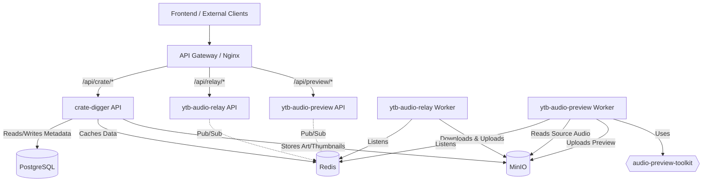
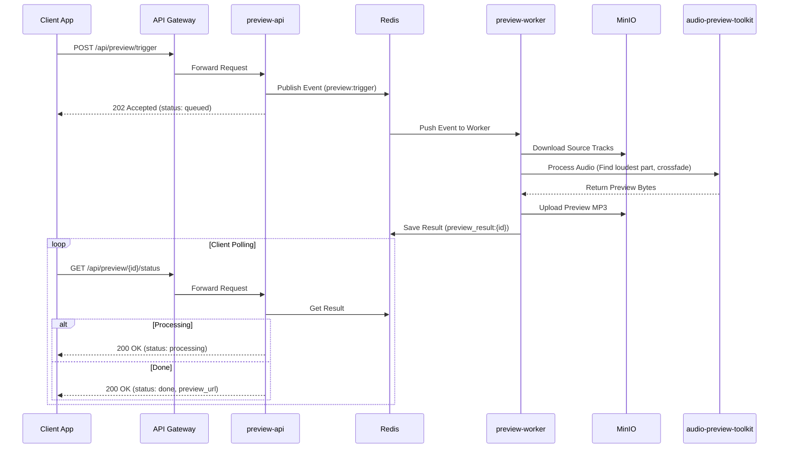

# 🎧 Crate Digger Audio Ecosystem

Welcome to the central orchestration repository for the **Crate Digger Audio Ecosystem**. 

This repository (`api-gateway` / `crate-digger-compose`) acts as the unified entry point for the entire platform. It houses the **Nginx API Gateway** and the master **`docker-compose.yml`** that binds together a suite of decoupled, event-driven microservices, shared infrastructure, and background workers.

## 🏗️ High-Level Architecture

The ecosystem follows a microservices architecture, utilizing **Redis Pub/Sub** for asynchronous event broadcasting and **MinIO** for distributed object storage.



### 🔄 End-to-End Flow: Generating an Audio Preview



---

## 📦 Repository Map

The ecosystem is split into **11 distinct repositories**, following a strict separation of concerns. Each microservice has its own API, TypeScript client, and dedicated E2E testing suite.

| Repository | Role | Tech Stack | Dependencies |
| :--- | :--- | :--- | :--- |
| **`crate-digger-compose`** *(This Repo)* | Orchestration, Routing & Infra | Docker, Nginx | All microservices |
| [`audio-preview-toolkit`](https://github.com/nikiforidi/audio-preview-toolkit) | Core Audio Processing Logic | Python, Pydub, FFmpeg | Published to **PyPI** |
| [`crate-digger`](https://github.com/nikiforidi/crate-digger) | Metadata & Discogs API | Python, FastAPI, SQLAlchemy | Postgres, Redis, MinIO |
| [`crate-digger-ts`](https://github.com/nikiforidi/crate-digger-ts) | TS Client for Crate Digger | TypeScript, Fetch API | Published to **npm** |
| [`crate-digger-e2e`](https://github.com/nikiforidi/crate-digger-e2e) | E2E Tests for Crate Digger | TypeScript, Vitest | GHCR images, `crate-digger-ts` |
| [`ytb-audio-relay`](https://github.com/nikiforidi/ytb-audio-relay) | Telegram Audio Downloader | Python, FastAPI, Telethon, ARQ | Redis, MinIO |
| [`ytb-audio-relay-client`](https://github.com/nikiforidi/ytb-audio-relay-client) | TS Client for Relay | TypeScript, Fetch API | Published to **npm** |
| [`ytb-audio-relay-e2e`](https://github.com/nikiforidi/ytb-audio-relay-e2e) | E2E Tests for Relay | TypeScript, Vitest | GHCR images, `ytb-audio-relay-client` |
| [`ytb-audio-preview`](https://github.com/nikiforidi/ytb-audio-preview) | Audio Preview Generator | Python, FastAPI, ARQ | Redis, MinIO, `audio-preview-toolkit` |
| [`ytb-audio-preview-client`](https://github.com/nikiforidi/ytb-audio-preview-client) | TS Client for Preview | TypeScript, Fetch API | Published to **npm** |
| [`ytb-audio-preview-e2e`](https://github.com/nikiforidi/ytb-audio-preview-e2e) | E2E Tests for Preview | TypeScript, Vitest | GHCR images, `ytb-audio-preview-client` |

---

## 🛠️ Shared Infrastructure

All services communicate over a dedicated Docker bridge network (`app-net`) and share the following stateful services:

*   **PostgreSQL 15**: The single source of truth for relational metadata (used exclusively by `crate-digger`).
*   **Redis 7**: Acts as the central nervous system. Used for caching, ARQ background job queues, and Pub/Sub event broadcasting between APIs and Workers.
*   **MinIO**: S3-compatible object storage. Stores raw audio tracks, generated previews, and Discogs artwork.

---

## 🚀 Local Development

### Prerequisites
*   Docker & Docker Compose (V2)
*   A `.env` file (copy from `.env.example` and fill in your Telegram & Discogs credentials).

### Starting the Stack
```bash
# 1. Copy and configure environment variables
cp .env.example .env

# 2. Start all services in the background
docker compose up -d

# 3. Verify all APIs are healthy via the Gateway
curl http://localhost/health
curl http://localhost/api/crate/health
curl http://localhost/api/relay/health
curl http://localhost/api/preview/health
```

### Viewing Logs
```bash
# Follow logs for a specific microservice
docker compose logs -f ytb-audio-preview-worker
```

---

## 🛡️ CI/CD & Testing Architecture

The ecosystem relies on a robust, multi-layered CI/CD pipeline powered by GitHub Actions.

1.  **Unit Tests (`ci.yml`)**: Each microservice repository runs `pytest` and `pre-commit` hooks on every push.
2.  **Docker Publishing**: When a SemVer tag (e.g., `v1.2.3`) is pushed, GitHub Actions builds the Docker image and publishes it to **GitHub Container Registry (GHCR)**.
3.  **E2E Integration (`*-e2e` repos)**: 
    *   The E2E repositories pull the **latest published GHCR images**.
    *   They install the **latest published npm TS clients**.
    *   They spin up the exact production stack using `docker compose`.
    *   They execute real-world scenarios (e.g., triggering a Telegram download, waiting for the Redis pub/sub event, verifying the file lands in MinIO).
4.  **Gateway Integration (`test-compose.yml`)**: This repository's CI ensures that all microservices can boot together, share the same Redis/MinIO instances, and route correctly through Nginx.

---

## 🔌 API Gateway Routing

The Nginx gateway strips the prefixes and routes traffic to the internal Docker network:

| External URL | Internal Service | Port |
| :--- | :--- | :--- |
| `http://localhost/api/crate/*` | `crate-digger` | `8000` |
| `http://localhost/api/relay/*` | `ytb-audio-relay` | `8000` |
| `http://localhost/api/preview/*` | `ytb-audio-preview` | `8000` |
